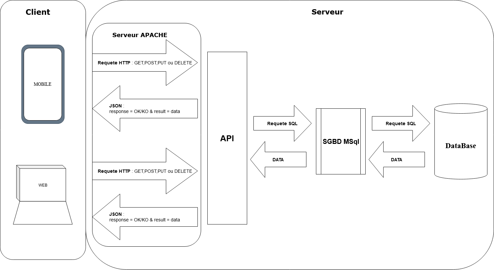

# Lord of the Trips - Architecture matérielle et logicielle

## Général

Dans ce document, nous allons vous présenter l'architecture matérielle et logicielle de l'application.

## Architecture matérielle et rôles de entités

Schéma des entités et de leur modes de communication

Rôles de différentes entités intervenant dans l'application :

 - Les clients (Web et mobile) : ils constitue l'interface d'accès de l'utilisateur  à l'API. Au travers de pages et des actions utilisateurs, les clients Web et Mobile envoi des requêtes HTTP à l'API et traitent les réponses reçues afin de les afficher de façon compréhensive à l'utilisateur final. 
 - Serveur Apache : son rôle est d'écouter/réceptionner les requêtes émises par les clients, de les envoyer à l'API et de renvoyer ensuite au client, la réponse de l'API.
 - L'API : elle est l'interface entre les demandes clients et le SGBD. Elle traite les demandes reçues via le serveur Apache, envoi des requêtes au SGBD afin de répondre aux demandes, et renvoi via le serveur Apache le résultat de ces requêtes.
 - Le SGBD : Il réceptionne les requêtes de l'API et les traitent afin d'accéder au données proprement dites. Il renvoi ensuite le résultats des dites requêtes à l'API.
 - La base de données : elle est le lieu physique du stockage de la donnée.

## Choix technologiques

### API

Le choix des technologies possibles pour une API est vaste : Java, PHP, Python , C#, ... Chaque langage ayant ses spécificités, ses avantages et ses inconvénients. Après avoir étudié plusieurs options, nous avons arrêté notre choix sur Python et le framewok Pyramid.

#### Pourquoi choisir Python et Pyramid ?

La première raison qui nous a fait choisir Python, a été le souhait d'apprendre une nouvelle technologie, même si celle-ci été connu d'un des membres de l'équipe. D'autres critères beaucoup plus raisonnés ont motivé notre choix.

 - Tout d'abord Python est un langage relativement facile à apprendre et donc cela ne pouvais être qu'un atout dans la réalisation du projet. Nous aurions eu une phase d'apprentissage quelque soit le langage choisi, autant prendre celui qui serait le plus aisé à apprendre.
 - le langage python dispose d'un des dépôt de recensement de paquage performant et très complet  **PyPI**. Son objectif est de doter la communauté des développeurs Python d'un catalogue complet recensant tous les paquets Python libres, ce qui facile la recherche et l'installation des bibliothèques
 - Le possibilité de créer facilement des environnements virtuel de développement et basculer rapidement entre eux, ce qui permettra de tester de façon sécurisé l'installation d'une nouvelle librairies ou de tester plusieurs librairies pour une même fonctionnalités sans encombrer l'environnement de développement. 
 - Python a récemment retrouvé ses lettres de noblesses, en étant très utilisé dans le domaine du traitement de données (machine learning, BI, etc). Il dispose d'un écosystème très fourni dans ce domaine, et représente aussi un atout du point de vue professionnel.

Pour utiliser Pyton, nous avons choisi d'utiliser le framework [Pyramid](https://trypyramid.com/). Il s'agit d'un micro-framework, il est donc plus facile à apprendre et bien plus léger à implémenter, ce qui convient à une apllication de petite taille comme la notre. De plus, Il consomme moins de ressources et n’impose rien. Chaque fonctionnalité peut être implémentée par la bibliothèque externe de son choix. Autre point fort de Pyramid, sa documentation est riche et précise. 

####  Les  librairies Python implémentés dans le projet

-   [SQL Alchemy](https://www.sqlalchemy.org/) pour l'ORM pour l'ORM pour la création et l'interaction avec la base de données :  
Nous avons choisir de passer  par un ORM car il permet d'accéder aux SGBD de façon uniforme quelque soit le SGBD utilisé. Il nous permettra 
	-	De creer les tables au travers de classes qui seront directement mapper à la base de données
	-	De créer des scripts qui dialogue avec la base de données sans émettre d’ordres SQL.
	-	De créer des traitement sans réellement prendre en compte les spécificités liés à un SGBD particulier.

-   [PyMySQL](https://pypi.org/project/PyMySQL/) pour la connexion à la base de données :
PyMySQL est une librairie pour se connecter à un serveur de base de données MySQL depuis Python. Il contient une bibliothèque cliente MySQL pure Python. 

-   [Marshmallow](https://marshmallow.readthedocs.io/en/stable/) pour la génération et le traitement des fichiers JSON. Elle permet:
    - De transformer facilement un objet python en JSON et inversement de transformer un fichier JSON en objet Python. 
    - D'ajouter des contrôles et traitements sur les donneés en entrée et en sortie de l'API.

-   [Cornice](https://cornice.readthedocs.io/en/latest/) pour la contruction des routes. Cette librairie permet de créer facilement les routes de l'API et de normaliser le codes utilisé.

### Web

Dans le développement de page web, HTML et CSS sont incontournables pour la mise en page et le graphisme. L'interactivité des pages se fait à l'aide de JavaScript, la majeure partie des navigateurs disposant d'un moteur JavaScript dédié pour l'interpréter. Nous avons aussi décidé d'utiliser la bibliothéque **ReactJS**

####  Pourquoi choisir React JS 

 Plusieurs raisons ont motivé ce choix:
- Le gain de temps et d'efficacité, de nombreuses fonctionnalités sont déjà présentes ce qui nous dispensent de les développer.
- Les normes de développement implémenter permette de poser un cadre et de donner une base commune à tous les développeurs qui seront sur le projet.
- La possibilité de créer des composants autonomes qui seront réutilisé encore et encore. 
- Sa pérennité, l'application existe depuis 2013. Il s'agit de plus bibliothèque développée et utilisé par Facebook. Il y très  peu de chance qu'elle disparaisse du jour au lendemain ou ne soit plus maintenue, 
- Sa grande communauté est importante et étant donné qu'il est 100% open source. De ce fait, React est sans cesse mis à jour et s’adapte en permanence aux contraintes de développement. 
- La maitrise de l'outil par l'équipe et la possibilité de nous appuyer sur les professeurs si nous rencontrons des difficultés.
- Sa popularité nous laisse à penser qu'il peut représenter un atout du point de vue professionnel.

####  Les  libriaries React JS implémentés dans le projet

- **material-ui** : Cette libraire n'était pas indispensable, mais elle nous a permis de gagner du temps sur le design avec ses composants prêts à l'emploi, avec des icones, des composants.
- **React-native-navigation** : Cette librairie nous a permis d'organiser nos composants de manière hiérarchique,  et de naviger de l'un à l'autre.
- **react-query** : Pour communiquer avec l'api
- **ReactKonva** : Libraire indispensable pour créer les cartes. Elle nous a permit de manipuler facilement les points de passages et les segments sur la carte.

### Mobile

Dans l’écosystème mobile, deux acteurs se taillent la part du Apple (avec iOs) et Google (avec Android). D’autres plateformes existes (RIM avec BlackBerry ou Windows avec Windows Phone), mais ils restent marginales
Lorsque l’on fait du développement pour mobile, il convient de bien choisir son périmètre ( un seul os, les eux, ..), de définir le type de développement(natif ou multiplateformes) et de bien entendu le choix de l’outil de développement. Nous avons décidé de nous orienter vers du développement multiplateformes et choisi le framework React Native.

#### Pourquoi React Native

- React Native permet de développer des applications qui fonctionne à la fois sur IOS et Android, nous permettant de coder une seule application pour ces deux plateformes.  Nous avons 1 seul code et donc uniformité du code et, de la logique, mais aussi de l’apparence et  de l’expérience utilisateur. 
De plus, toutes les mises à jour et correctifs seront également automatiquement reflétés partout. 

- React Native est un framework basé sur la librairie React, nous avons déjà dans l'équipe des compétences en React. De plus, nous avons fait le choix de développer notre client web en React, ce qui permet de s'appuyer sur plusieurs ressources en cas de problème.

- React Native dispose d'une excellente documentation, ainsi que d'une importante communauté en ligne ce qui nous aidera en cas de blocage.

####  Les  libriaries React Native implémentés dans le projet

- **Expo** : Permet de nous fournir une interface pour communiquer facillement avec les composants natifs du téléphone (le gps, le podomètre mais aussi le sélectionneur d'image pour les obstacles). Expo nous a aussi été utile durant le développement, car il nous permettait d'avoir un serveur de dev, et il nous a facilité la mise en production de  l'application, car il possède un service de build automatique.
- **React-Native-Elements** : Cette libraire n'était pas indispensable, mais elle nous a permis de gagner du temps sur le design avec ses composants prêts à l'emploi.
- **React-native-navigation** : Cette librairie nous a permis d'organiser nos composants, et de naviger de l'un à l'autre.
- **React-redux** : Pour créer un store de données. Il nous a été indispensable pour partager facillement les variables entre les différents composants de notre application
- **react-native-markdown-display** : Pour afficher la description des challenges rédigés en markdown
- **react-native-dropdown-alert** : Pour afficher des alertes au dessus de l'application afin de mettre au courrant l'utilisateur d'erreurs ou de warnings.

- **Axios** : Pour communiquer avec l'api
- **Loadash** : Cette librairie a permis de facillement traiter les données envoyés par l'api, avec ses fonctions *find*, *map* et *filter*.
- **react-native-svg** : Pour afficher la carte et ses icones.
