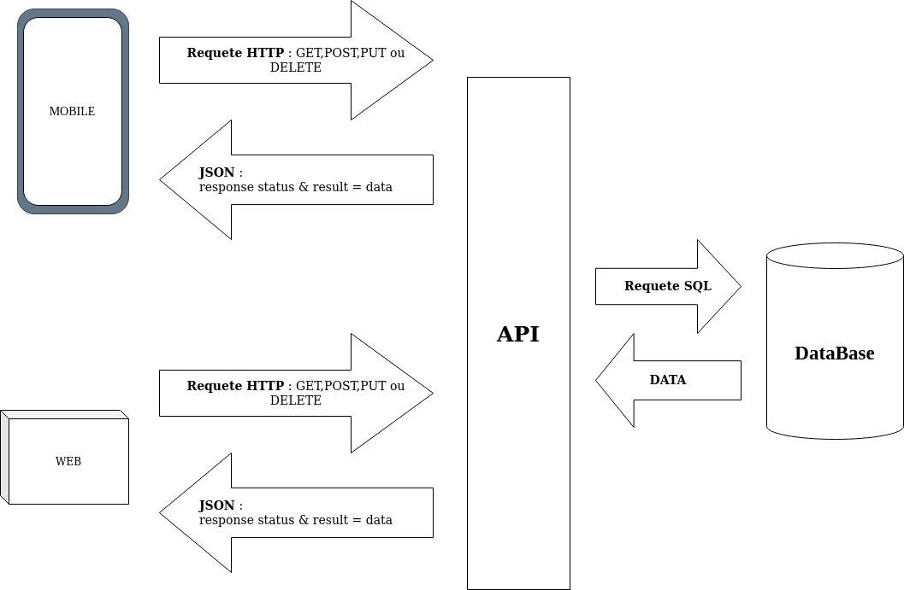
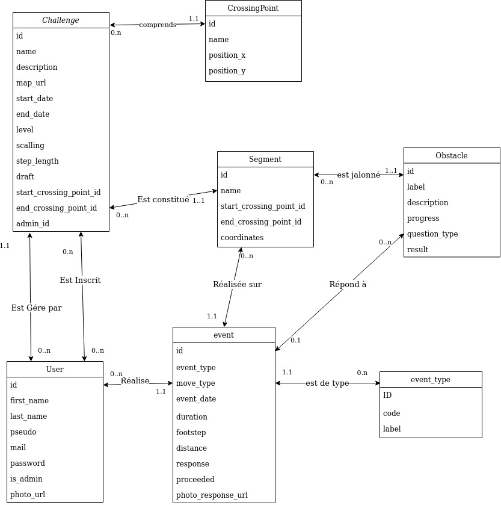

# API Lord of the Trips

## Choix techniques

### Technologies
- Langage [Python](https://www.python.org/)
- framework [Pyramid](https://trypyramid.com/)
- [SQL Alchemy](https://www.sqlalchemy.org/) pour l'ORM
- [PyMySQL](https://pypi.org/project/PyMySQL/) pour la connexion à la base de données
- [Marshmallow](https://marshmallow.readthedocs.io/en/stable/) pour la génération des fichiers JSON
- [Cornice](https://cornice.readthedocs.io/en/latest/) pour la construction des routes

### Architecture et communication

La communication entre le(s) client(s) et l'API se fait via des requêtes HTTP envoyées par le(s) client(s). En retour, l'API renvoie une réponse HTTP et le cas échéant, un fichier JSON avec les données demandées. 

Les différentes requêtes gérées sont :
 - GET : récupération des données et retourne soit un objet, soit un tableau 
 - POST : création des données et retourne l'objet créé 
 - PUT :   Mise à jour de l'ensemble des champs d'un objet et retourne le statut HTTP 204 ou un statut d'erreur si un problème se produit 
 - PATCH : Mise à jour de un ou plusieurs champs d'un objet et retourne le statut HTTP 204 ou un statut d'erreur si un problème se produit 
 - DELETE : Suppression d'un objet et retourne le statut HTTP 204 ou un statut d'erreur si un problème se produit

Du coté API, la communication vers la base de données se fait via des requêtes SQL. Pour la génération des requêtes, nous utilisons l'ORM SQL Alchemy et les données reçues sont ensuite transformées en JSON via la bibliothéque Marshmallow.

 Vous trouverez [ici](https://hephaistos.nathanaelderousseaux.fr/apidoc/) la documentation présentant l'ensemble des requêtés gérer par l'API.

### Accès sécurisé aux routes :

L'ensemble des routes de l'API à l'exception de la page d'accueil, de la page de connexion et de la page d'inscription sont sécurisé par un token. 
Le token est généré lors de la connexion d'un utilisateur et est spécifique à chaque utilisateur. Il s'agit d'un token de type JWT, voir la [documentation officiel](https://pypi.org/project/pyramid-jwt/) pour plus de détails.

## Normes de développement

### Règles de nommage

Pour les différents éléments de code, les règles de nommage sont les suivantes :
* Variables et fonctions sont en Snake case, ex : ma_variable
* Constantes sont aussi en Snake case mais à la différence des précédents, elle sont en majuscule, ex : MA_CONSTANTE
* Classes sont en Pascal case, ex : MaClasse

La langue utilisé pour la définition des différents éléments est l'anglais et il convient dans la mesure du possible de définir un nom ayant du sens, par exemple segments_list pour une liste de segments.

### Architecture des fichiers

 L'ensemble des fichiers et répertoires de l''API se trouvent dans le répertoires backend/server.

A ce niveau se trouve : 

* Les fichiers nécessaires au framework pyramid, à python et au déploiement de l'API.
* Le répertoire contenant l'environnement virtuel créé pour le projet.
* Le répertoire loftes qui contient les répertoires et les fichiers de l'API.

Dans le répertoire loftes, nous avons des sous répertoires dédiés aux différents types de fichiers:  

* **models** : ici vous trouverez les classes définissant les tables de la base de données, 1 classe = 1 table.
* **views** : fichier contenant les vues de l'API, c'est dans ce fichier que se trouvent les routes d'accès à la base de données, nous avons un fichier par entité de la base de données, ainsi qu'un fichier pour la partie authentification.
* **ressources** : dans ce fichier, vous trouverez différentes fonctions qui permettent d'interagir avec les données, comme par exemple des requêtes complexes, la fonction de validation des parcours...
* **marshmallow_schema** : dans ce fichier nous avons mis en place les classes permettant de transformer les objets Python en fichiers JSON qui pourront être envoyés au client, et aussi de convertir les fichiers JSON en objets utilisables par l'API.
* **security** : fichiers servant à la sécurité de l'API, tel que la gestions des mots de passe
* **services** : fichier des services, comme par exemple les fonctions de construction des messages de retour HTTP

## Règles de gestion

### Règles de création/modification des données en base

 - Challenge
	 - Le nom est obligatoire et doit être unique
	 - Dans le cas ou le challenge est limité dans le temp, la date de début doit strictement supérieur à la date du jour et la date de fin doit être strictement supérieur à la date de début
	 - Par défaut, le challenge est crée avec draft à TRUE, ce champ est uniquement mis à jour par la route de validation des challenges
 - Crossing point : si un nom est saisie, il doit être unique pour le challenge
 - Segment
	 - Il doit avoir un start et un end crossing point, et le crossing point de début doit être différent de celui de fin
	 - si un nom est saisie, il doit être unique pour le challenge
 - Event : le type d'évènement est obligatoire
 - Utilisateur :
	 - Les champs nom, prénom, pseudo, email, mot de passe sont obligatoires 
	 - L'email est unique 
 
### Règles de validation des challenges et de leurs parcours

Lors de la validation d'un challenge, celui doit répondre au règles suivantes :
 - Les champs suivants sont obligatoires :
	 - Nom
	 - Description
	 - Point de départ et d'arrivée
	 - Echelle
	 - Taille des pas
	 - il doit avoir une carte rattachée
- Si un obstacle est présent sur le challenge, il doit avoir un label 

Le parcours dessiné sur la carte doit répondre aux règles suivantes :

 - Tous les segments doivent avoir un point de départ et d'arrivé et une liste de coordonnées permettant de les dessiner sur la carte. 
 - Tous les crossing point de départ doivent être rattaché à un segment

### Règles des évènements Utilisateur sur un parcours

Les actions de l'utilisateur sur un challenge et un parcours sont stockés dans une table d’événement : EVENTS. Nous avons défini 9 évènements différents et défini un flux d'enchainement des différents évènement entre eux.

#### Les différents types d'évents

| Code en base| Description|
| ------ | ------ |
| START| Départ de parcours|
| ARRIVAL| Arrivée à la fin du parcours|
| MOVE| Déplacement, sera complété par le type de déplacement |
| OBSTACLE_ARR | Arrivé sur un obstacle|
| OBSTACLE_REP | Réponse à un obstacle |
| OBSTACLE_REP_KO | Refus de la réponse par un administrateur ou par le système|
| OBSTACLE_REP_OK| Réponse valider |
| CROSS_PT_ARRIVAL | Arrivée à un point de passage|
| CHOOSE_SEGMENT| Choix d'un segment |

#### Enchainement des évènements

Dans le diagramme ci-dessous, vous pouvez voir l'ordre des différents évènements, ainsi que les conditions nécessaires à un évènement précis. A noter qu'il faut que votre joueur soit inscrit à un challenge pour pouvoir réaliser un évènement START  

## Schéma de la base de données

## Quelques outils pour le développement

 1. Ajout d'un table en base de données 
	  - Création de la classe de description de la table dans le répertoire models
	  - Lancement de l'initialisation de la base de données
 2. Ajout d'une route dans l'API
	- Création de la route avec Cornice dans le fichier correspond à la route qui se trouve dans le répertoire views, pour ex un route agissant sur les challenges sera dans le fichier ChallengeView.py
	- Si nécessaire, création de la structure du fichier JSON correspondant à la route dans le répertoire marshmallow_schema
