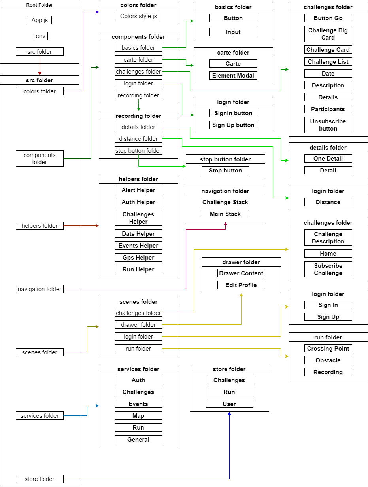

# Application Mobile Lord of the Trips

## Choix techniques

### Technologies

- Langage : [JavaScript](https://developer.mozilla.org/fr/docs/Web/JavaScript)
- FrameWork : [React Native](https://reactnative.dev/)
- Librairies React Native notables utilisées :
    - [React Native Elements](https://reactnativeelements.com/)
    - [Redux](https://redux.js.org/)
    - [React Native SVG](https://github.com/react-native-svg/react-native-svg)
    - [Axios](https://github.com/axios/axios)
    - [React Navigation](https://reactnavigation.org/)
- Technologie de création de projet / lancement en développement : [Expo](https://docs.expo.io/)

### Communication

L'application mobile communique avec l'API via des requêtes [HTTPS](https://fr.wikipedia.org/wiki/HyperText_Transfer_Protocol_Secure#:~:text=de%20mani%C3%A8re%20secr%C3%A8te.-,HTTPS,-et%20piratage%5Bmodifier) et reçoit les données formatées en JSON. L'URL de l'API est à définir dans le fichier `.env` du projet.

## Normes de développement

### Règles de nommage

Pour l'architecture de l'application :
- Dossiers : nommage en [Camel Case](https://fr.wikipedia.org/wiki/Camel_case)
- Fichiers : nommage en [Pascal Case](https://techterms.com/definition/pascalcase)
- Components : nommage en [Pascal Case](https://techterms.com/definition/pascalcase)

Pour le code, tout est rédigé en anglais excepté pour les éléments de texte qui seront potentiellement affichés à l'utilisateur

### Architecture des fichiers

L'architecture de l'application se situe dans le dossier `src`, et contient :
- `colors` : 1 fichier contenant les couleurs principales de l'application
- `components` : plusieurs dossiers contenant des sous-éléments correspondant aux divers [components JSX](https://fr.reactjs.org/docs/components-and-props.html) utilisés dans l'application
- `helpers` : plusieurs fichiers contenant le code à effectuer lors de requête à l'API
- `navigation` : 2 fichiers contenant les components de navigation de [React Navigation](https://reactnavigation.org/)
- `scenes` : plusieurs dossiers contenant des sous-éléments correspondant à des "conteneurs" avec à l'intérieur les éléments du dossier `components` que l'on souhaite
- `services` : plusieurs fichiers contenant les requêtes à appeler dans les fichiers de `helpers`
- `store` : plusieurs fichiers contenant le code utilisant la librairie [Redux](https://redux.js.org/)

Pour les dossiers contenant beaucoup d'éléments (comme le dossier `components` et `scenes`), le tout est organisé selon le rapport entre les éléments, par exemple :
- Les components de la carte sont tous situés dans le dossier `components\carte` 
- Les components des challenges (liste comme fiche) sont tous situés dans le dossier `components\challenges`

