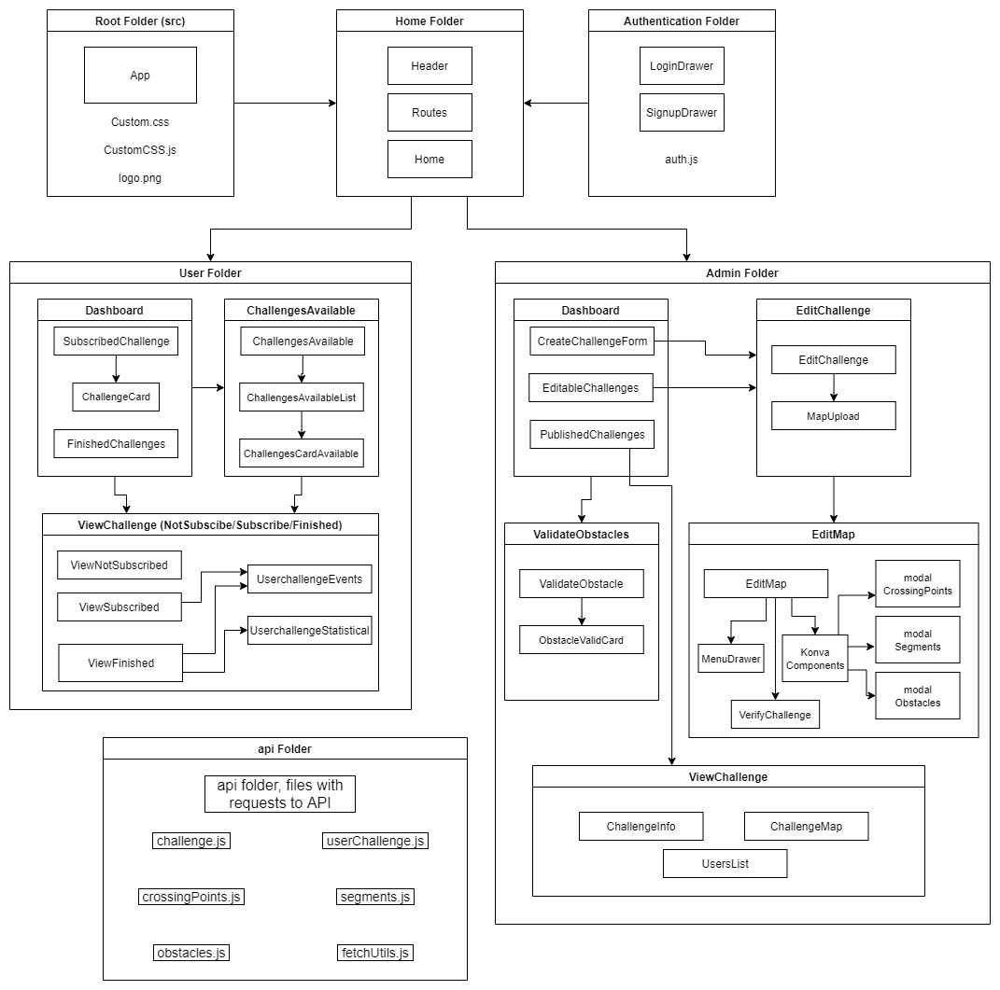

# Web site Lord of the Trips

## Choix techniques

### Technologies

- Langage [Javascript](https://developer.mozilla.org/fr/docs/Web/JavaScript)
- Framework [React](https://fr.reactjs.org/)
- Librairie [ReactQuery](https://react-query.tanstack.com/) pour les requêtes à l'API
- Librairie [ReactRouter](https://reactrouter.com/) pour le routage dans l'application Web
- Librairie [KonvaJs](https://konvajs.org/), plus particulièrement la version adaptée à react [ReactKonva](https://konvajs.org/docs/react/index.html) pour créer les cartes des challenges
- Librairie [MaterialUI](https://material-ui.com/) pour le design de l'application

### Architecture et communication

- Le client web communique avec une API via des requêtes HTTP qui répond avec des données en JSON, pour plus de détails sur l'API, [DocumentationTechniqueAPI](https://git.unistra.fr/acrobatt-1/lord-of-the-trips/-/blob/master/Documentation/DocumentationTechnique/API%20Documentation.md)
- Pour le détails des routes, [APIdoc](https://hephaistos.nathanaelderousseaux.fr/apidoc/). Séléctionnez la version 0.3 pour avoir toutes les dernières routes
- Pour connecter le client web à l'API, il vous suffit de spécifier son url dans la variable `urlPrefix` qui se trouve dans le fichier `src/api/fetchUtils.js` pour connecter le client web à l'API.
- NB : L'application web se situe dans le dossier `/dev/frontend/web/lord-of-the-trips`

## Normes de développement

### Règles de nommage

Pour les différents éléments de code, les règles de nommage sont les suivantes :
* Les noms des fichiers sont en Camel case, ex : editMap.js
* Les composants sont en Pascal case, ex : EditMap
* Les variables et fonctions sont en Camel case, ex : crossingPoints

La langue utilisé dans le code pour les fichiers/commentaires/variables/... est l'anglais, mais tout ce qui est affiché à l'utilisateur est en français. L'application est prévue pour des utilisateurs français.

### Architecture des fichiers et des composants

L'ensemble des fichiers et répertoires du client web se trouve dans `/dev/frontend/web/lord-of-the-trips`

Dans le répertoire src :
- A la racine de src :
  - App.js : Point d'entrée de l'application, configuration de react query et de react router, le rendu est le header et le fichier routes
  - CustomCSS.js (et Custom.css) Fichiers contenants le CSS qui est utilisé par toute l'application (Certains CSS spécifiques se trouvent directement dans les fichiers qui l'utilisent)
- Dossier Home :
  - Header.js : Contient le header de l'application
  - Routes.js : Contient les routes. Le fichier affiche un composant selon la route dans le navigateur
  - Home.js : Page d'accueil du site
- Dossier Authentication : Tout ce qui concerne la connection utilisateur
  - LoginDrawer.js : Popup pour se connecter
  - SignupDrawer.js : Popup pour s'inscrire
  - auth.js : Contient la logique de connexion : utilise un contexte pour que les données de l'utilisateur connecté soit accessible partout dans l'application
- Dossier Api : Contient les requêtes à l'API
  - Les requêtes sont séparées dans différentes fichiers (challenges, segments, ...)
  - Le fichier fetchUtils.js contient des fonctions utilitaires pour les requêtes. **Il contient le préfix utilisé pour toutes les requêtes, à changer selon l'url du serveur**
- Dossier User : La partie utilisateur de l'application
  - Dashboard.js : Point d'entrée de la partie utilisateur de l'application, affiche les challenges où l'utilisateur est inscrit (SubscribedChallenge) et les challenges finis (FinishedChallenges). On peut accéder aux challenges disponibles pour s'inscrire (ChallengesAvailable). Pour chaque challenge, on peut accéder à une page de détails selon l'état de l'utilisateur sur le challenge (ie : ViewNotSubscribed, ViewSubscribed, ViewFinished)
  - ChallengesAvailable : Liste des challenges disponibles pour s'inscrire
  - ViewNotSubscribed : Affiche les données d'un challenge et sa carte
  - ViewSubscribed : Données d'un challenge, carte et actions de l'utilisateur
  - ViewFinished : Données d'un challenge, carte, actions de l'utilisateur et statistiques
- Dossier Admin : La partie administrateur de l'application
  - Dashboard.js : Point d'entrée de la partie administrateur de l'application, permet de switcher entre le dashboard et la validation manuel d'obstacles. Le dashboard affiche la liste des challenges en cours de création et la liste des challenges publiées. On peut aussi créer un nouveau challenge.
  - ValidateObstacle.js : Page permettant de valider manuellement les obstacles soumis par les utilisateurs sur les challenges publiés par l'administrateur connecté.
  - EditChallenge.js : Page pour éditer les informations du challenge et uploader la carte. c'est sur cette page qu'on peut publier le challenge
  - EditMap.js : Page pour modifier le parcours du challenge. On peut placer les points de passages, les segments, les obstacles et le départ et l'arrivé. On peut notamment édité les obstacles dans des fenêtres modals. Un bouton permet de vérifier que le graphe du parcours est valide.
  - ViewChallenge.js : Affiche les informations et la carte d'un challenge publié à l'administrateur, il peut voir la liste des utilisateurs inscrits à son challenge.

