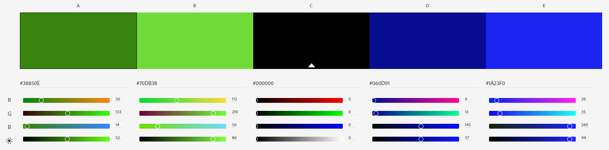
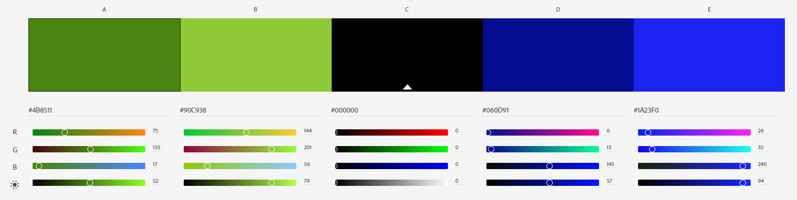

## Couleurs

## Logo

[inspiration](https://image.shutterstock.com/image-vector/concept-circuit-board-tree-futuristic-600w-1037970676.jpg)

## Police

Cinzel pour les titres

Montserrat pour le corp

## Icones

- Démarrer un enregistrement
- Upload
- Menu 'Profil'
- Menu 'mes challenges'

Inspiration :
[Idée 1](https://www.flaticon.com/packs/business-analytics-17)
[Idée 2](https://www.flaticon.com/packs/christmas-21)

[A voir 1](https://www.flaticon.com/packs/global-logistic-4)
[A voir 2](https://www.flaticon.com/packs/painting-tools-8)   
[A voir 3](https://www.flaticon.com/packs/food-restaurant-3)
[A voir 4](https://www.flaticon.com/packs/jewelry-2)

## les boutons

[Doc de définition des boutons](https://git.unistra.fr/acrobatt-1/lord-of-the-trips/-/blob/master/conception/Ergonomie&Graphisme/BOUTONS.pdf)

## Design
- Designer les boutons d'action