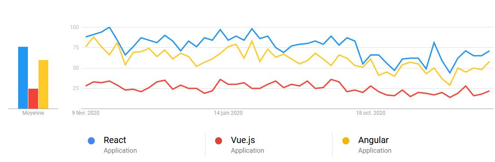
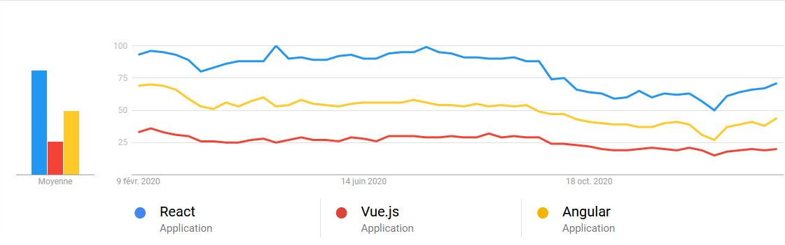
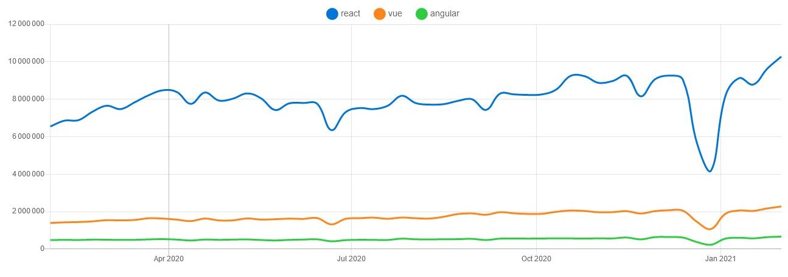
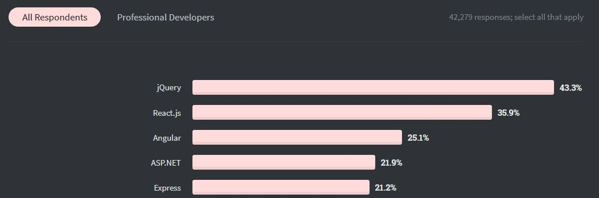
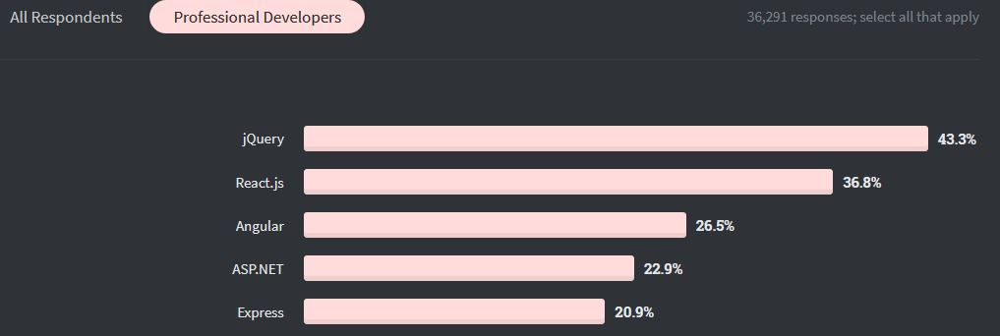

Dans le développement de page web, HTML et CSS sont incontournables pour la mise en page et le graphisme. L'interactivité des pages se fait à l'aide de JavaScript, la majeure partie des navigateurs disposant d'un moteur JavaScript dédié pour l'interpréter. Là ou la question se posent c'est dans la nécessité d'utiliser un framework. 

# Pourquoi un framework

Nous avons décidé d’implémenter le code JavaScript avec un framework. Plusieurs raisons ont motivé ce choix:
- Le gain de temps et d'efficacité, de nombreuses fonctionnalités sont déjà présente dans le framework  ce qui nous dispensent de les développer
- Le Framework permet de poser un cadre et de donner une base commune à tous les développeurs qui seront sur le projet.
- La structuration du code et de l'architecture induit par un framework nous permettra d'avoir d’emblée une meilleur qualité de code.

Même si l'utilisation d'un framework présente de nombreux avantages, il comporte également des  inconvénients :
- Certaines fonctionnalités ou évolutions récentes peuvent ne pas être géré par le framework. 
- Selon la taille du projet, un framework trop complexe peut ajouter une couche de complexité inutile.
- Le temps de formation sur l'outil peut parfois effacer le gain de temps qu'il nous aura permis de gagner

# Choix du framework

## Les différents frameworks

Lors des recherches effectués par l'équipe, 3 frameworks tiennent le haut du pavé

### AngularJS

AngularJS est un framework JavaScript open source développé par Google. Sa première version date de 2009. 

Il est considéré comme performant et robuste. Ses mises à jour sont fréquentes et il dispose d'une grande communauté en ligne, et sa documentation officielle est détaillée.
Mais son apprentissage peut être est long et ardu, et si il est très complet pour le développement d’applications web, il semble que son code peut rapidement devenir trop complexe.

### Vue.js 

Appelé plus simplement Vue, il a été créé par Evan You en 2014 et est basé sur le modèle MVVM (Modèle / Vue / Vue-Modèle), Vue se concentre principalement sur la couche Vue.

L’un des gros avantages de VueJS, est sa simplicité et sa documentation officielle claire et complète. DE plus, il est HTML et CSS compatible. Par contre, étant donné qu'il est le plus récent des 3 framework, sa communauté est plus restreinte et on peut donc parfois rencontrer certains problèmes d’intégrations.

### React.Js

Il s'agit d'une bibliothèque JavaScript libre développée par Facebook depuis 2013.

L'un des avantages de ReactJS est qu'il permet de créer des composants autonomes qui seront réutilisé encore et encore. Sa communauté est importante et étant donné qu'il est 100% open source, React est sans cesse mis à jour et s’adapte en permanence aux contraintes de développement. 
Par contre le développement des composant utilise la syntaxe JSX, ce qui nécessite un apprentissage supplémentaire et la documentation react n'est pas toujours très fournie.

## Comment s'est fait notre choix ?

N'ayant pas forcement le temps de développer l'apprentissage des ces différents framework, nous nous sommes d'abord appuyer sur plusieurs critéres 

1. Sa pérennité

- Angular est utilisé dans presque tous les produits Google dont Adwords.
- React utilisé par Facebooke et dans d'autres produit appartenant à Facebook.
- Pour Vue.js, il reposent uniquement sur son créateur et sa communauté ce qui est un peu plus instable.

2. Sa popularité

Elle conditionnera la taille de sa communauté, mais aussi la facilité de recrutement des développeurs qui seront amenés à travailler dessus soit car ils seront déjà formés, soit car ils  seront intéressés par l'opportunité professionnelle proposé. Pour mesurer cette popularité nous nous sommes appuyés 

- Les comportements de recherche des consommateurs sur Google trends
  - Pour la france
    
  - Pour tout le web
    
    Source : [Google trend](https://trends.google.com/trends/?geo=US)
- Les téléchargement via npm des 3 frameworks
 
 Source : [npm trend](https://www.npmtrends.com/)
- Les frameworks les plus populaires pour les utilisateurs de StackOverFlow
  - Tous utilisateurs confondus
    
  - Plus spécifiquement pour les développeurs professionnels
    
    Source : [Insights stackoverflow](https://insights.stackoverflow.com/survey/2020)

3. La maitrise de l'outil dans l'équipe

## En conclusion

Nous avons choisi d'utiliser React car :
- Nous avons déjà des compétences dans ce framework dans l'équipe.
- Nous pouvons solliciter l'aide des professeurs sur ce framework.
- Il dispose d'une grande communauté et donc nous pourrons au besoin nous adresser à elle en cas de blocage.
- Sa popularité nous laisse à penser qu'il peut représenter un atout du point de vue professionnel.
