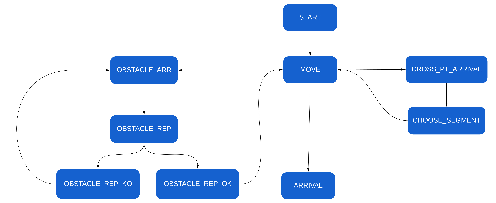

Les actions de l'utilisateur sur un challenge et un parcours seront stockés dans une table d’événement : EVENTS

# La table EVENTS

# Les différents types d'évents

| Code en base| Description|
| ------ | ------ |
| START| Départ de parcours|
| ARRIVAL| Arrivée à la fin du parcours|
| MOVE| Déplacement, sera complété par le type de déplacement |
| OBSTACLE_ARR | Arrivé sur un obstacle|
| OBSTACLE_REP | Réponse à un obstacle |
| OBSTACLE_REP_KO | Refus de la réponse par un administrateur ou par le système|
| OBSTACLE_REP_OK| Réponse valider |
| CROSS_PT_ARRIVAL | Arrivée à un point de passage|
| CHOOSE_SEGMENT| Choix d'un segment |

# Flow Chart des évents

